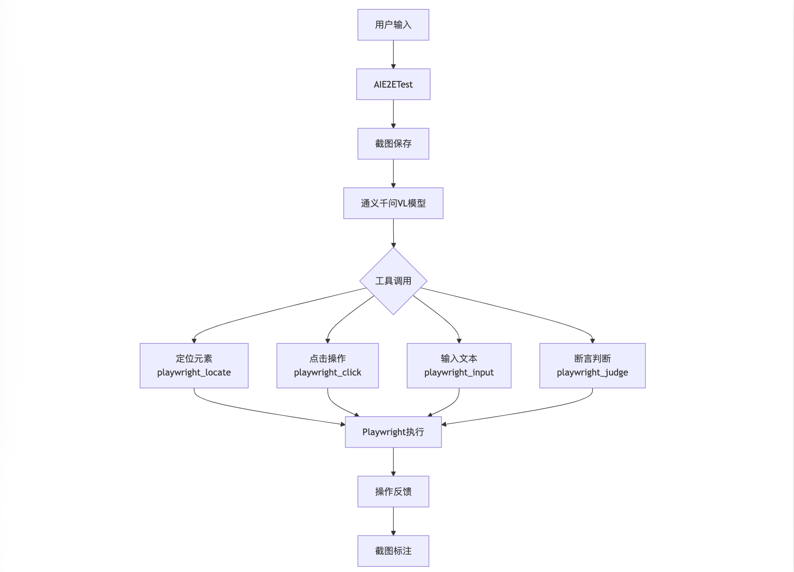

# AI E2E Testing Framework

基于Playwright和通义千问VL模型的AI驱动E2E测试框架，支持通过自然语言描述来执行UI测试和断言。

## 功能特点

- 支持自然语言驱动的UI操作和断言
- 集成通义千问2.5-VL大模型进行图像理解和操作决策
- 基于Playwright实现浏览器自动化操作
- 自动生成操作过程的截图和标注
- 提供简洁易用的API接口

## 功能架构



## 快速开始

### 安装依赖

```bash
npm install
```

### 环境配置

1. 在项目根目录创建`.env`文件
2. 配置通义千问API密钥：
```
QWEN_API_KEY=your_api_key
```

### 使用示例

```javascript
const AIE2ETest = require('./src/index.js');

// 初始化测试实例
const test = new AIE2ETest();

// 启动浏览器
await test.init();

// 访问目标页面
await test.goto('https://example.com');

// 执行AI驱动的UI操作
await test.aiAction('点击登录按钮');

// 执行AI驱动的断言
await test.aiAssert('检查是否显示登录成功提示');

// 关闭浏览器
await test.close();
```

## API文档

### AIE2ETest类

#### init()
启动浏览器实例

#### goto(url: string)
访问指定URL

#### aiAction(userInput: string)
执行AI驱动的UI操作，支持点击、输入等动作

#### aiAssert(userInput: string)
执行AI驱动的断言判断

#### close()
关闭浏览器实例

## 注意事项

- 确保已正确配置通义千问API密钥
- 执行测试前需要先调用init()方法
- 每次操作后会自动保存带标注的截图在.tmp/img目录下